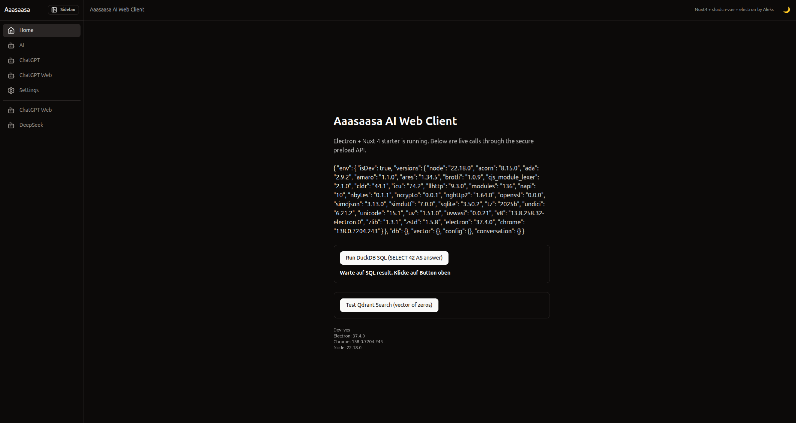

[](https://www.electronjs.org/)
[](https://nuxt.com/)
[](https://duckdb.org/)
[](https://qdrant.tech/)
[](https://pnpm.io/)
[](https://appimage.org/)

# Aaasaasa AI Web Client — ROOT README.md (enhanced)

**Aaasaasa AI Web Client** is a **desktop (Electron) + web (Nuxt 4 SPA)** client for AI workflows: chat, local functions, RAG search, and PDF/HTML ingestion. Focus: speed, local control, and integration with vector search.

This repository covers the **Web Client**. For the complete system, it is recommended to also use:

* **`aaasaasad`** – local/remote **daemon** (REST/WS) for `/chat`, `/memorize`, `/search`, load-balancing (vLLM sessions…), etc.
* **`aaasaasa-cli`** – CLI tool (document ingest, export/import, collection management).
* **Qdrant** – local vector database (RAG/top‑K) for document & query search, analytics, profiling.
* **DuckDB** – local integrated database (sessions, messages, metrics).

> Renderer is a **pure SPA** (SSR disabled). DuckDB and Qdrant are *not imported* from Nuxt — everything goes via **Electron IPC**.

---

## ✨ Features

* 🖥️ **Electron + Nuxt 4 (SPA)**: fast startup, isolated Chromium profile, DevTools.
* 🔐 **Preload bridge**: `contextIsolation`, `nodeIntegration=false`, `sandbox=false` (desktop app).
* 🗃️ **DuckDB (Node‑API)**: local SQL/analytics; CSV/Parquet ingest handled in the main process.
* 📊 **Qdrant**: RAG & semantic search (REST client in main process).
* ⚙️ **Config via JSON**: `aaasaasa.config.json` (dev: root; prod: copied into `resources/`).
* 🎛️ **Workspaces & UI**: theme (dark/light/system), accent color, font size.
* 🔌 **LLM provider layer**: `aaasaasa-cli`, OpenAI, Ollama, HF (via config).
* 🛡️ **Security modes**: relaxed CSP for desktop; optional cross‑origin isolation for WASM needs.
* 🐧 **Packaging**: Linux **AppImage** + **.deb**; Windows **.exe**; macOS **.dmg** (planned).

---

## 🧱 Architecture

```
┌──────────────────────┐
│  Electron (main)     │  ← .env (dev) + aaasaasa.config.json (prod/resources)
│  - IPC handlers       │
│  - DuckDB (node-api)  │
│  - Qdrant REST        │
│  - fetch/cheerio      │
│  - security (CSP)     │
└─────────▲────────────┘
          │ IPC (preload exposes window.aaasaasa)
┌─────────┴────────────┐
│  Nuxt 4 SPA renderer  │
│  - UI (Tailwind/shadcn)│
│  - Chat store / RAG UI │
└─────────▲────────────┘
          │ HTTP/WS (optional)
┌─────────┴─────────────┐
│  aaasaasad (daemon)    │
│  - /chat, /memorize    │
│  - sessions, search    │
└────────────────────────┘
```

Additionally: Qdrant (vectors) • DuckDB (local records)

---

## ✅ Prerequisites

* **Node.js** 20+ (24+ recommended)
* **pnpm**
* **Qdrant** running on `http://localhost:6333` (or set in config)
* Linux for building (AppImage/deb). Windows/macOS builds supported via electron‑builder.

---

## 🚀 Quick Start (dev)

1. Clone the repo and place `aaasaasa.config.json` in **root** (example below).
2. (Optional) `.env` in **root** (dev only), e.g.:

```env
NODE_ENV=development
DEV_SERVER_URL=http://localhost:3000
```

3. Start dev:

```bash
./bootstrap.sh
```

The script cleans build artifacts, loads root `.env`, starts **Nuxt dev** (`app/`) and **Electron** (`electron/main.cjs`).

> Dev mode reads `.env` from the **repo root**, not from packaged paths.

---

## 📦 Production build

```bash
./bootstrap-prod.sh
```

This will:

* Run Nuxt static build → `app/.output/public`
* Copy renderer → `electron/renderer/` (packed into **app.asar**)
* Copy `aaasaasa.config.json` (root → `resources/`)
* Run `electron-builder` (AppImage + deb)

> In **production**, `.env` is **not used**; values come from `aaasaasa.config.json`.

---

## 🗂️ Project structure

```
aaasaasa-web-client/
├─ aaasaasa.config.json   # single source of truth (root)
├─ app/                   # Nuxt 4 (SPA)
│  ├─ assets/css/tailwind.css
│  ├─ plugins/*.client.ts
│  ├─ pages/index.vue
│  └─ nuxt.config.ts      # ssr:false; app.baseURL ('/' for app://); buildAssetsDir '_nuxt/'
├─ electron/
│  ├─ main.cjs            # window + IPC + DuckDB/Qdrant init
│  ├─ preload.cjs         # exposes window.aaasaasa (readonly)
│  ├─ web.cjs             # fetch/http + cheerio helpers
│  ├─ vector.cjs          # Qdrant REST adapter
│  ├─ security.cjs        # CSP/permissions (relaxed desktop mode)
│  └─ renderer/           # (prod) Nuxt output (packed in asar)
├─ bootstrap.sh
├─ bootstrap-prod.sh
└─ README.md
```

---

## ⚙️ Configuration (`aaasaasa.config.json`)

**Example:**

```json
{
  "ui": { "appTitle": "Aaasaasa AI Tool by Aleks" },
  "apiBase": "http://localhost:3000",
  "wsBase": "ws://localhost:3000",
  "duckdb": {
    "path": "./duckdb/aaasaasa.duckdb",
    "threads": "auto",
    "memoryLimit": "12GB"
  },
  "rag": {
    "vectorStore": {
      "url": "http://localhost:6333",
      "collection": "aaasaasa",
      "size": 384
    }
  },
  "security": {
    "allowedOrigins": [
      "http://localhost:3000",
      "http://localhost:6333",
      "https://api.openai.com",
      "https://cdn.jsdelivr.net",
      "https://unpkg.com"
    ]
  },
  "ai": {
    "provider": "openai",
    "openai": { "baseURL": "https://api.openai.com/v1", "model": "gpt-4o-mini", "apiKey": null },
    "ollama": { "baseURL": "http://localhost:11434" },
    "hf": { "inferenceURL": "", "apiKey": null }
  },
  "features": { "streaming": true, "rollingSummary": true, "telemetry": false }
}
```

**Policy:** Dev reads `.env` + config from **root**; Prod copies config into `resources/` and does **not** use `.env`.

---

## 🧩 Nuxt config (SPA for Electron)

```ts
// app/nuxt.config.ts
export default defineNuxtConfig({
  ssr: false,
  app: {
    // For app:// loader keep '/'; for file:// use './'
    baseURL: '/',
    buildAssetsDir: '_nuxt/'
  },
  nitro: { preset: 'static' }
});
```

---

## 🌐 `app://` protocol loader (no file:// pitfalls)

**Electron main (snippet):**

```js
protocol.registerSchemesAsPrivileged([
  { scheme: 'app', privileges: { standard: true, secure: true, supportFetchAPI: true, corsEnabled: true, stream: true } }
]);

protocol.registerFileProtocol('app', (request, callback) => {
  const u = new URL(request.url);              // app://-/_nuxt/entry.js
  const clean = decodeURI(u.pathname).replace(/^\/+/, '');
  const base = path.join(__dirname, 'renderer');
  let target = path.normalize(path.join(base, clean));
  if (!target.startsWith(base)) return callback({ error: -6 });
  fs.stat(target, (err, st) => {
    if (!err && st.isDirectory()) target = path.join(target, 'index.html');
    else if (err && !path.extname(clean)) target = path.join(base, 'index.html');
    callback({ path: target });
  });
});

// In prod ALWAYS use a real host component, e.g. 'app://-/index.html'
win.loadURL('app://-/index.html');
```

> If you load `app://index.html`, the host becomes `index.html` and `/_nuxt/*` resolves to `app://index.html/_nuxt/*` → 404. Use `app://-/index.html` or `app:///index.html`.

---

## 🦆 DuckDB (Node‑API) — init & locking

**db.cjs (essentials):**

```js
let instance = null, connection = null, currentPath = null;

async function init(cfg = {}) {
  const { DuckDBInstance, DuckDBConnection } = require('@duckdb/node-api');
  const target = cfg.path || ':memory:';
  if (connection && currentPath === target) return connection; // idempotent
  if (connection) await closeDuck();

  instance = await DuckDBInstance.create(target);
  connection = await DuckDBConnection.create(instance);
  currentPath = target;

  const threads = Number(cfg.threads) || require('os').cpus().length || 1;
  await connection.run(`PRAGMA threads = ${threads}`);
  if (cfg.memoryLimit) await connection.run(`PRAGMA memory_limit = '${cfg.memoryLimit}'`);
  return connection;
}
```

**Main process (single init + single instance lock):**

```js
const gotLock = app.requestSingleInstanceLock();
if (!gotLock) { app.quit(); return; }

app.whenReady().then(async () => {
  const raw = loadConfigRaw();
  const cfg = normalizeConfig(raw);
  await duckdb.ensurePath(cfg.duckdb?.path);
  await duckdb.init(cfg.duckdb); // single init
  createWindow();
});

app.on('before-quit', () => duckdb.closeDuck().catch(() => {}));
```

**Tips to avoid `Conflicting lock is held …`:**

* Do **not** start dev & packaged app at the same time on the *same DB file*.
* Use different DB paths per mode (e.g. dev `:memory:` or separate `userData/dev`).
* Initialize DB **once** and reuse the connection.

---

## 🔌 IPC bridge (preload → `window.aaasaasa`)

```ts
window.aaasaasa: {
  env:    { isDev: boolean, versions: Record<string,string> },
  config: { get(): Promise<any> },
  db:     { sql(query: string, params?: any[]): Promise<any> },
  vector: {
    upsert(points: Array<{ id?: string|number, vector: number[], payload?: any }>, opts?: any): Promise<any>,
    search(vector: number[], opts?: { top?: number, limit?: number, score_threshold?: number }): Promise<any>
  },
  chat?:  { open(): Promise<{ ok: true }> }
}
```

**Examples (Nuxt):**

```ts
const rows = await (globalThis as any).aaasaasa.db.sql('SELECT 42 AS answer');
const hits = await (globalThis as any).aaasaasa.vector.search(new Array(384).fill(0), { top: 3 });
```

---

## 🧰 Scripts

* `./bootstrap.sh` — dev mode (cleans, loads `.env`, starts Nuxt + Electron)
* `./bootstrap-prod.sh` — prod build (Nuxt build, copy renderer + config, electron‑builder)

---

## 🧯 Troubleshooting

* **Blank page / 404 for `/_nuxt/*`** → ensure `app://-/index.html` and protocol handler above.
* **DB `not initialized`** → call `duckdb.init(...)` *before* first IPC `db:sql`.
* **`Could not set lock on file …`** → another process holds the DB; ensure single instance and distinct dev/prod DB paths.
* **DevTools** not opening → call on `ready-to-show` and/or use `Ctrl/Cmd+Shift+I` shortcut.

---

## 🗺️ Roadmap

* [ ] Separate READMEs for `electron/` (IPC/preload/security) and `app/` (UI/store/plugins)
* [ ] Rolling summary util (stable chat > 300 messages)
* [ ] Qdrant top‑K cache & chunking ingest
* [ ] PDF generator and optional Python bridge
* [ ] CI (lint/test/build) and release scripts

---

## 📜 License

TBD (temporarily: All rights reserved / or MIT at your decision).

DuckDB and Qdrant are under their respective licenses.
